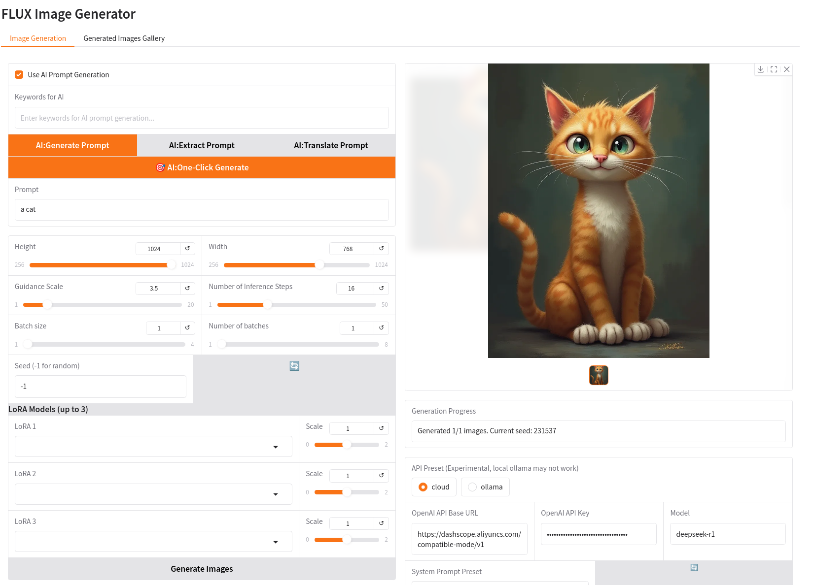

# FreeFlux: Smart and Simple Flux for GPU-poor

Make FLUX more accessible to the public using 4-bit quantized model, and using CPU offloading technique, allowing a 12GB GPU to run FLUX.

Be able to use **DeepSeek-R1 AI** to generate fantistic prompts for FLUX from really simple keywords, which is a quality of life improvement, since I never get the tips and tricks to generate good prompts. **Note: to use this you need an OpenAI API Compitable endpoint and your API key, Aliyun is a very good candidate!!**

Tested on NVIDIA Geforce RTX 3060 12GB, with Ubuntu 22.04 Linux, Python 3.10.12, 64GB CPU memory. AMD GPUs are not supported.

## Features:

- [x] 4-bit Flux-DEV quantized model  
- [x] Optional CPU offloading  
- [x] DeepSeek-R1 AI prompt generation  
- [x] LoRA and multiple LoRAs  
- [x] Gallery browse and management  
- [x] One-click install
- [x] Gradio UI  
- [x] CLI command for batch generation

## Install

```bash
git clone https://github.com/litaotju/freeflux
cd freeflux 
# recommended to use virtualenv to avoid polluting the system python environment
python -m venv .venv && source .venv/bin/activate
pip install -e ./
```

## Usage

Start an gradio app in the local server, and use the UI.
```bash
python -m freeflux.app
```
Thats it, enjoy the images!!

The UI will look like this:


## Dependencies:
Tested torch 2.4.0, diffuser 0.30.3, bitsandbytes 0.45.2, transformers 4.49.0, gradio 5.17.1
Other versions may work, but not tested. 

## Common Issues
1. This app will need to connect the Huggingface and download models, use a proxy if you are China.


## Acknowledgement

Inspired by and utilizing the models provided by the following repo

    - https://huggingface.co/HighCWu/FLUX.1-dev-4bit  
    - https://github.com/HighCWu/flux-4bit  
    - https://huggingface.co/PrunaAI/FLUX.1-schnell-4bit  

